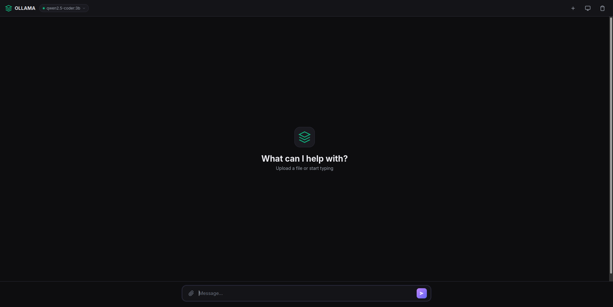
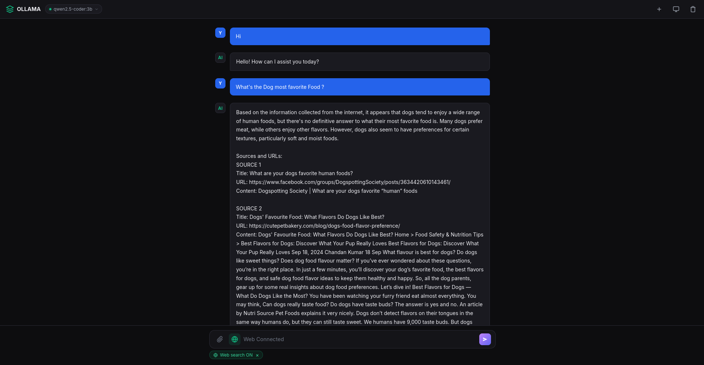

# Ollama Web UI

A clean, fast, no-sidebar chat interface for local Ollama models — with file upload, streaming, and built-in **Web Search**.

## Screenshots

| Normal Chat Mode | Web Search Mode |
|---|---|
|  |  |

## Features

- **File upload** — drag & drop or click the paperclip (PDF, TXT, code files)
- **Streaming** — real-time token output
- **Web Search** — click the globe button and the AI searches the internet before answering
  - Parallel page fetching
  - Page caching (10 min) for faster repeat queries
  - Live search status indicator
  - Sources listed at the end of every web answer
  - Graceful fallback to model knowledge if search fails
- **Fast & lightweight** — minimal JavaScript, no bloat
- **Keyboard shortcuts:**
  - `Enter` — Send
  - `Shift+Enter` — New line
  - `Ctrl+Shift+N` — New chat
  - `Ctrl+L` — Clear chat
  - `Esc` — Stop generating

---

# Requirements

Before installing Ollama Web UI, make sure you have:

- Linux, macOS, or Windows
- Python 3.10+
- Git
- Ollama
- Internet connection for installing dependencies and Web Search
- An Ollama model

This project is designed to run Ollama **locally** on your machine.

---

# Install Ollama

## Linux

Install Ollama using the official installer:

```bash
curl -fsSL https://ollama.com/install.sh | sh
```

After installation, check that Ollama is available:

```bash
ollama --version
```

Start the Ollama server:

```bash
ollama serve
```

Keep this terminal running while using the application.

### Check Ollama

Open another terminal and run:

```bash
ollama list
```

If Ollama is running correctly, you should see your installed models.

---

# Install the Ollama Model

This project uses:

```text
qwen2.5-coder:3b
```

Download the model:

```bash
ollama pull qwen2.5-coder:3b
```

Check that it was installed:

```bash
ollama list
```

You should see something similar to:

```text
NAME                SIZE
qwen2.5-coder:3b    ...
```

Test the model directly:

```bash
ollama run qwen2.5-coder:3b
```

Try asking:

```text
Write a Python hello world program.
```

To exit the model:

```text
/bye
```

---

# Verify Ollama API

Ollama normally provides its local API at:

```text
http://localhost:11434
```

You can test it with:

```bash
curl http://localhost:11434/api/tags
```

If Ollama is running, this should return information about your installed models.

---

# Clone the Project

Clone this repository:

```bash
git clone git@github.com:sayan08880/OLLAMA-UI.git
```

Enter the project directory:

```bash
cd OLLAMA-UI
```

---

# Create a Python Virtual Environment

It is recommended to use a virtual environment.

```bash
python3 -m venv venv
```

Activate it:

### Linux / macOS

```bash
source venv/bin/activate
```

### Windows

```powershell
venv\Scripts\activate
```

Your terminal should now show something similar to:

```text
(venv)
```

---

# Install Python Dependencies

Install the required packages:

```bash
pip install -r requirements.txt
```

If `pip` is not available, use:

```bash
python3 -m pip install -r requirements.txt
```

---

# Configure the Ollama Model

The application is configured to use:

```text
qwen2.5-coder:3b
```

Make sure the model exists locally:

```bash
ollama list
```

If it is missing:

```bash
ollama pull qwen2.5-coder:3b
```

The application connects to the local Ollama server at:

```text
http://localhost:11434
```

---

# Start the Application

First, make sure Ollama is running:

```bash
ollama serve
```

Then open another terminal.

Activate your virtual environment:

```bash
cd OLLAMA-UI
source venv/bin/activate
```

Start the Flask application:

```bash
python app.py
```

You should see Flask start on:

```text
http://localhost:5000
```

Open your browser and visit:

**http://localhost:5000**

---

# Complete Setup Example

For a fresh Linux installation, the complete setup is:

```bash
# 1. Install Ollama
curl -fsSL https://ollama.com/install.sh | sh

# 2. Download the model
ollama pull qwen2.5-coder:3b

# 3. Clone the project
git clone git@github.com:sayan08880/OLLAMA-UI.git

# 4. Enter the project
cd OLLAMA-UI

# 5. Create virtual environment
python3 -m venv venv

# 6. Activate virtual environment
source venv/bin/activate

# 7. Install dependencies
pip install -r requirements.txt

# 8. Start Ollama
ollama serve
```

Open another terminal:

```bash
cd OLLAMA-UI
source venv/bin/activate

# 9. Start the Web UI
python app.py
```

Then open:

```text
http://localhost:5000
```

---

# How Web Search Works

1. Click the globe icon to enable Web Search.
2. Enter your question.
3. The backend searches DuckDuckGo.
4. Relevant pages are fetched in parallel.
5. Retrieved content is cached for faster repeat searches.
6. A compact context is sent to the local Ollama model.
7. The model generates the response.
8. Sources are displayed at the end of the answer.

If Web Search fails, the application can fall back to the model's existing knowledge.

---

# Supported Files

The application supports files such as:

```text
.pdf
.txt
.md
.py
.js
.html
.css
.c
.cpp
.java
.go
.rs
.json
.sql
.sh
```

and many other text/code formats.

You can upload a file and ask questions such as:

```text
Explain this code.
```

```text
Find bugs in this file.
```

```text
Summarize this document.
```

Large files are automatically truncated when necessary to fit the model's context.

---

# Project Structure

```text
OLLAMA-UI/
├── app.py
├── requirements.txt
├── templates/
│   ├── index.html
│   └── logo.png
├── static/
│   ├── script.js
│   └── style.css
└── IMG/
    ├── normal-mode.png
    └── web-search-mode.png
```

---

# Tips

- Make sure **Ollama is running** before starting the Web UI.
- Make sure `qwen2.5-coder:3b` is installed.
- Click the globe icon to enable Web Search.
- Upload a file and ask the AI to explain or analyze it.
- Use `Shift+Enter` for a new line.
- Use `Esc` to stop generation.
- Everything related to model inference runs locally through Ollama.

---

# Troubleshooting

## Ollama command not found

Check:

```bash
ollama --version
```

If Ollama is not installed, install it using the official Ollama installer.

## Model not found

Run:

```bash
ollama pull qwen2.5-coder:3b
```

Then verify:

```bash
ollama list
```

## Cannot connect to Ollama

Check whether Ollama is running:

```bash
ollama serve
```

Then test:

```bash
curl http://localhost:11434/api/tags
```

## Port 5000 already in use

Check which process is using port 5000:

```bash
ss -ltnp | grep :5000
```

Stop the conflicting process or configure Flask to use another port.

---

# License

Add your preferred license here.
